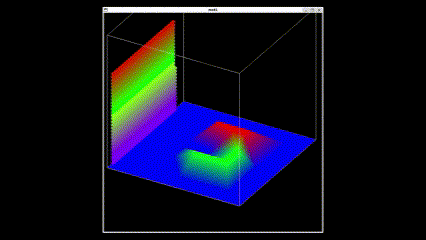

# コードについて

本コードは, 下記の手法用いて地表面を流れる水のシミュレーションを行うプログラムである.
- [TIN](https://docs.qgis.org/3.40/ja/docs/gentle_gis_introduction/spatial_analysis_interpolation.html) (地理情報システムで用いられる手法)
- [MPS法](https://particleworks.com/technical_information/mps_particlebasedmethod/) (流体シミュレーションで用いられる手法)

## その他の使用した手法
- ドロネー三角形分割
- 符号付き距離関数(SDF)
- バイリニア補間
- 三線形補間 (Trilinear Interpolation)

## 参考文献
- [粒子法入門](https://www.maruzen-publishing.co.jp/book/b10111917.html)
- [MPS法におけるポリゴン型壁境界モデルの開発](https://www.jstage.jst.go.jp/article/japannctam/61/0/61_0_169/_article/-char/ja/)
- [MPS法における壁境界計算モデルの改良](https://www.jstage.jst.go.jp/article/jsces/2008/0/2008_0_20080006/_article/-char/ja/)
- [ポリゴン型壁境界MPS法の特徴および防波堤越流津波への適用](https://www.jstage.jst.go.jp/article/kaigan/69/2/69_I_901/_pdf)


# 起動環境

WSL2 Ubuntu22.04

# 起動方法

WSL2 Ubuntu22.04で下記のコマンドを実行
```sh 
export LIBGL_ALWAYS_INDIRECT=0
```

```make``` コマンドを実行して, 実行ファイル```mod1```を作成  
```./mod1```または, ```./mod1 <map file path>``` を実行して起動する  
ここで, ```<map file path>``` にマップファイルを指定する

実行結果の例が下のgifである.
